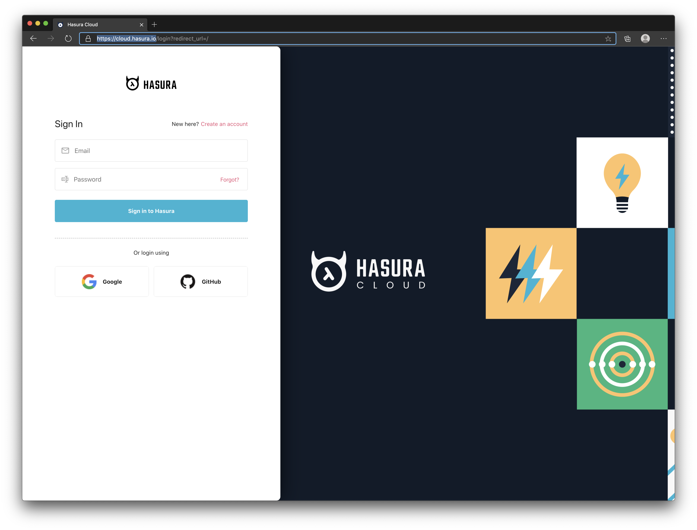
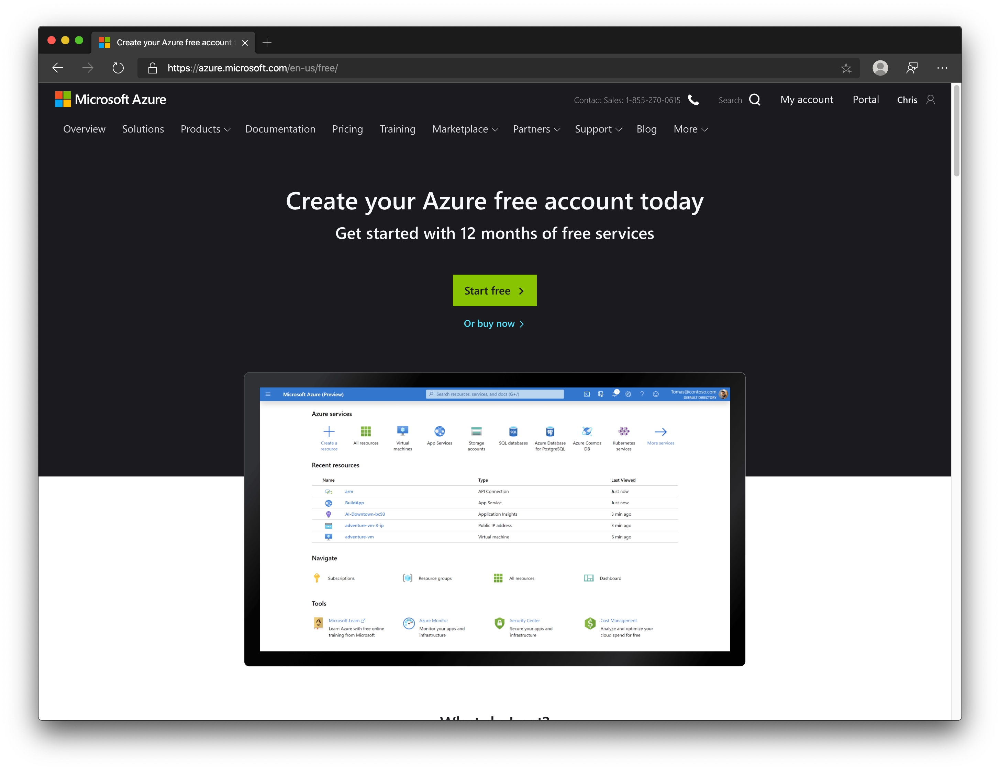
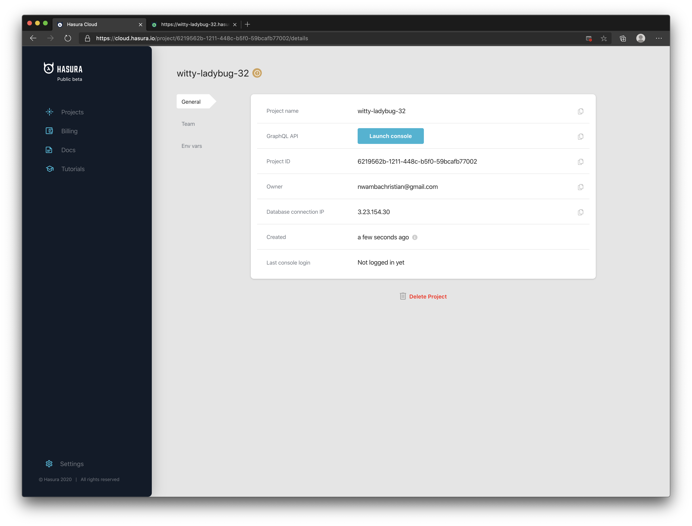

> [Hasura Cloud](https://hasura.io) launched while I was still working on this course so you don't need Docker to setup a GraphQL API anymore. If you want to use Hasura Cloud, then follow this article but skip to [Database Tables](/02-graphql-api/24-hasura-tables) section in this chapter. If you still want to keep using Docker, I recommend you also read this page to see how Hasura Cloud works then move to the next page.

## Exercise 1: Create a Hasura Cloud Account

Head to https://cloud.hasura.io and create an account

 

You should be redirected to the dashboard once you create an account:


## Exercise 2: Create a Postgres Database

Hasura gives you the flexibility to bring an existing database or a new one. In this regard, Hasura Cloud does not set up a database for you by default so you can have the freedom to bring yours.

Feel free to use any Postgres DB cloud provider but for this exercise, I am going to show you one that I am more convenient with -- [Azure Posgres Database](https://azure.microsoft.com/en-us/services/postgresql/?WT.mc_id=herm-workshop-chnwamba).

### Task 1: Create a Free Azure Account

Head to Azure and create [a free account](https://azure.microsoft.com/en-us/free)



You can also follow the steps in this two munites youtube video to create an account:

https://youtu.be/GWT2R1C_uUU

### Task 3: Setup Azure CLI

Follow the guide at the [Azure CLI docs](https://docs.microsoft.com/en-us/cli/azure/install-azure-cli?view=azure-cli-latest) to install the CLI tool for you operating system. In summary, here are the scripts for each OS to install the Azure CLI:

```bash
# MacOS
brew update && brew install azure-cli

# Windows (Powershell)
Invoke-WebRequest -Uri https://aka.ms/installazurecliwindows -OutFile .\AzureCLI.msi; Start-Process msiexec.exe -Wait -ArgumentList '/I AzureCLI.msi /quiet'

# Linux
curl -sL https://aka.ms/InstallAzureCLIDeb | sudo bash
```


Since you already created an Azure account, run the following command to use the browser to authenticate the CLI tool you installed:

```bash
az login
```

If you have multiple subscriptions, you also need to set a default one. Run the following to get a list of your subscriptions:

```bash
az account list
```

You should get the following output:

```json
[
  {
    "cloudName": "AzureCloud",
    "id": "<YOUR SUBSCRIPTION ID HERE>",
    "isDefault": true,
    "name": "<YOUR SUBSCRIPTION NAME HERE>",
    "state": "Enabled",
    "tenantId": "...",
    "user": {
      "name": "...",
      "type": "user"
    }
  },
  {
    "cloudName": "AzureCloud",
    "id": "...",
    "isDefault": false,
  ...
```


Copy the `id` of the subscription you want to set as default and run the following:

```bash
az account set --subscription <YOUR SUBSCRIPTION ID>
```

### Task 3: Create a Resource Group and Database

A resource group in Azure is like a folder on your computer. It allows you to group resources like the Postgres DB we are about to create. Run the following command to create a resource group

```bash
az group create \
  --name <RESOURCE_GROUP_NAME> \
  --location uksouth
```

Use this resource group to create a Postgres database:

```bash
az postgres server create \
  --name <DATABSE_NAME> \
  --resource-group <RESOURCE_GROUP_NAME> \
  --location uksouth \
  --admin-user <SERVER_ADMIN_USERNAME> \
  --admin-password <SERVER_ADMIN_PASSWORD> \
  --sku-name B_Gen5_1 \ 
```

Lastly, you need to allow connection access from all IP addresses. By default, you cannot connect from random IP addresses.

```bash
az postgres server firewall-rule create \
  --resource-group <RESOURCE_GROUP_NAME> \
  --server <DATABSE_NAME> \
  --name AllowIps \
  --start-ip-address 0.0.0.0 \
  --end-ip-address 255.255.255.255
```


Now that we have a databsae, let's head back to cloud.hasura.io and create a GraphQL API.

## Exercise 3: Create a Hasura Coud Project

Head to [Hasura Cloud](https://cloud.hasura.io/), log in and click the **Create my first project** button:


Paste the following in in the **Postgres Connection URI** field:

```bash
postgres://<SERVER_ADMIN_USERNAME>%40<DATABSE_NAME>:<SERVER_ADMIN_PASSWORD>@<DATABSE_NAME>.postgres.database.azure.com:5432/postgres
```

Replace the angle bracket placeholders with the values you used when creating the Postgress database. If you have a `@` in your password, replace it with `%40` so `@assword` should be `%40assword`.


Click the **Create project** button to create the Hasura project. You should see a page for your project and a button to access your API console:



Click the Launch console button to open your API console.

> Hasura Cloud uses pop-up to open the console so it can authenticaticate you before accessing the API. Your browser might block the pop-up so watch out for that and allow it.

Here is what the console looks like.


From the image above, you can see that you get a GraphiQL console but what is cool is that you can start adding tables to your Postgres database right from this console which gets converted into GraphQL mutations and queries.