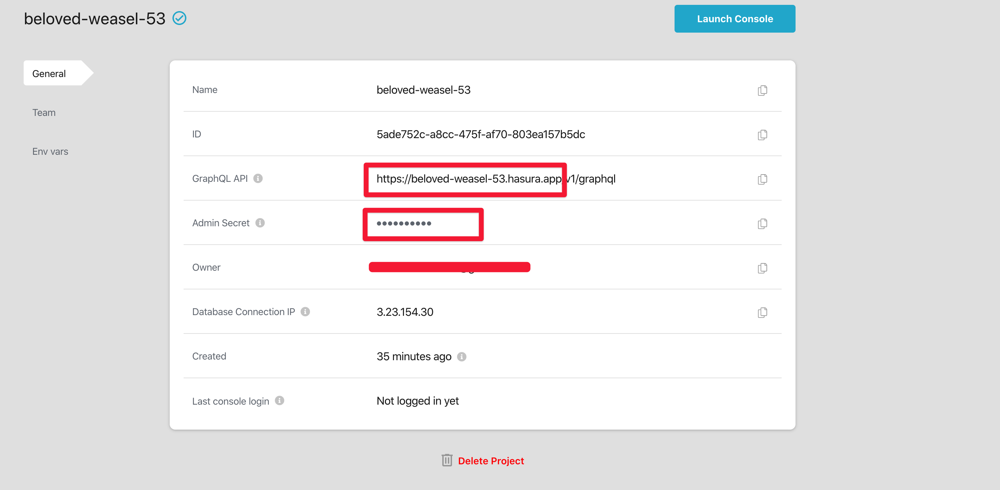

> Feel free to skip this page if you are using Hasura cloud

We have made good progress. We have a scalable backend that is well secured, and sometimes that’s all we ask for. Sometimes though, we also want to keep working locally and shipping our changes to the cloud.

Azure and Hasura give you an arsenal of tools to help you work locally and keep your app up to date. These tools are useful because we want to keep the data on local and production different while making sure that the database schema, as well as things like Hasura permissions, object relationships, etc. are synched between both environments. 
Let’s see what we can do about that.


## Objectives
- Setup Hasura CLI
- Generate migration code with Hasura CLI
- Apply migrations both locally and to production


## Exercise 1: Setup Hasura CLI

So far, we have seen one part of what makes up Hasura — the console. There is another part — the CLI tool, which hands you even more power.

First, you need to install it:

```bash
npm install --global hasura-cli@1.3.0

# Update to a hasura CLI version that has the features we need
hasura update-cli --version v1.3.0
```

Initialize Hasura in the same folder where you have the `docker-compose.yml` file:

```bash
## Initialize a Hasura code project
hasura init . --endpoint http://localhost:3100
```

This will create a `metadata` and `migrations` folder in your `api` folder as well as a `cofig.yaml` file.


## Exercise 2: Accessing Console from CLI

A migration code is a set of instructions that you can run on any Hasura endpoint to tell Hasura how it should set up the database, relationships, and permissions. It is the perfect tool for synching structure between local and production instances. That means we can edit the structure of your data from two possible places:

1. Hasura console directly
2. Opening console from Hasura CLI

The best practice is that you turn off accessing the console directly so you can have one source of change and make syncing easier. 

**Task 1: Disable Direct Console Access**

To turn off console locally, edit the `docker-compose.yml` file and turn `HASURA_GRAPHQL_ENABLE_CONSOLE` to `false`:

```yml
HASURA_GRAPHQL_ENABLE_CONSOLE: "false"
```

Restart the container:

```bash
docker-compose up -d
```

To turn off the console in production, run the following command:

```bash
az webapp config appsettings set \
    --resource-group herm \
    --name hermapi \
    --settings \
    HASURA_GRAPHQL_ENABLE_CONSOLE="false"
```

You need to update your action workflow too so that it does not override the settings:

```yml
- name: Update Hasura config
      env:
        HASURA_GRAPHQL_ADMIN_SECRET: ${{ secrets.HASURA_GRAPHQL_ADMIN_SECRET }}
      run: |
        az webapp config appsettings set \
          --resource-group herm \
          --name hermapi \
          --settings \
            HASURA_GRAPHQL_ADMIN_SECRET=$HASURA_GRAPHQL_ADMIN_SECRET \
+           HASURA_GRAPHQL_ENABLE_CONSOLE="false" \
            HASURA_GRAPHQL_ENABLED_LOG_TYPES="startup, http-log, webhook-log, websocket-log, query-log"
```

If you visit `localhost:3100` or `<your-app-name>.azurewebsites.net`, you should get the following:


> The console is turned off by default if you are using Hasura Cloud

**Task 2: Access Console from CLI**

Now you have only one way to access the console, the CLI. To use it, make sure your terminal is at the `api` folder.

Then run the following command:

```bash
hasura console \
    --admin-secret <secret>
```

Since we have this secret in `.env/hasura.dev.env`, run the console command using the file:

```bash
hasura console \
    --envfile .env/hasura.dev.env
```

The command will open the local Hasura console:


Let's move the endpoint url to our environmental variable. Remove the endpoint from `config.yml` so it looks like this:

```yml
version: 2
metadata_directory: metadata
actions:
  kind: synchronous
  handler_webhook_baseurl: http://localhost:3000
```

Update `.env/hasura.dev.env` to include the url:

```bash
# other envs...
HASURA_GRAPHQL_ENDPOINT=http://localhost:3100
```

Now we can create another env file for production credentials:

```bash
touch .env/hasura.prod.env
```

Update the production env with the following:

```bash
HASURA_GRAPHQL_ENDPOINT=<YOUR PRODUCTION ENDPOINT URL>
HASURA_GRAPHQL_ADMIN_SECRET=<YOUR PRODUCTION ADMIN SECRET>
```

If you are using Hasura Cloud, you can get your admin secret and API from your Projects' General page.



> Note: The API stops at `.app` and does not include the `/v1/graphql` path

Now you can open the production console with:

```bash
hasura console --envfile .env/hasura.prod.env
```

## Exercise 3: Generating Migrations and Migrations

### Generating Migrations

Let’s generate a migration based on the tables and relationships we created in the previous chapter. We only need to do this once because subsequently, Hasura will update our migrations when we create

```bash
 hasura migrate create "Initial Migration" \
    --from-server \
    --envfile .env/hasura.dev.env
```

The command will generate a version number that looks like this `1582009940933`. The `--from-server` flag tells Hasura to generate SQL statements and Hasura meta data from the endpoint server. The endpoint can be passed using `--endpoint` or using `--envfile`. If your server is protected with admin secret like ours, you also need to pass an `--admin-secret` or put in the `--env-file` as well.


Look inside your `api/migrations` folder and should see some generated code including an SQL file.

### Generating Metadata

Migration and metadata can be confusing but they are fairly straight-forward. A migration generates database schema while a metadata generates data describing your Hasura setup, eg: permissions, relationships, tables, etc. 

In the examples I listed z*relationships* and *tables* which is where it seems like there is a mix up because a migration also describes relationship and tables. The difference is, the relationship tracked in metadata is either object or array relationship but not schema/foreign key relationship. By default Hasura does not keep track of databases that you did not create directly in the Hasura console. You can use tables metadata to list the tables you would like Hasura to track.

Metadata are stored in the `metadata` folder. 

To create metadata based on the current database schema, run the following:

```bash
hasura metadata export \
    --envfile .env/hasura.dev.env
```

You should see an updated content in `metadata/tables.yml` file

## Exercise 4: Applying Migrations and Metadata

You can take this generated migration and apply it to a particular endpoint. Let’s start with applying it locally:

**Task 1: Apply Migration Locally**

```bash
hasura migrate apply \
    --version <VERSION NUMBER FROM EXERCISE 3> \
    --skip-execution
    --envfile .env/hasura.dev.env
```

Why are we applying migrations to an endpoint we generated the migrations from? I asked this question as well when I was learning about all this stuff. The reason is that if a migration file exists, every endpoint that syncs with that migration must know about it. This way a different source can edit the migration file, and it can still be used to update the endpoint that generated it

Nothing changes on the structure of our database when we run this because of the `--skip-execution` flag. The local Hasura setup just *marks* this migration as applied to the local server.

**Task 2: Apply Migration in Production**

This is where it gets fun. Remember how empty our production backend was when we created it? Now we are going to move all the database schema and Hasura metadata we have locally to production with the migration and metadata files we created.

```bash
# Apply migration
hasura migrate apply \
    --envfile .env/hasura.prod.env

# Apply metadata
hasura metadata apply \
    --envfile .env/hasura.prod.env
```

Open the console from the terminal to confirm the migration:

```bash
hasura console \
    --envfile .env/hasura.prod.env
```

You can see that we now have a database structure which in turn generates this GraphQL schema:


## Exercise 5: Adding Changes

Updating the structure henceforth is more straightforward. Three steps:


1. Open the **source** console (where you will be making changes) using the CLI
2. Make changes to the schema
3. Apply changes to the **destination** console.

Let’s see an example.

**Task 1: Local to Production Changes**

Open the local console:

```bash
hasura console --envfile .env/hasura.dev.env
```

Go to the **Data** tab and click the **account** table. Next Click on **Modify** tab to change the structure of the table.


Under the **Add a new column section**, click on **Frequently used columns** to add a `created_at` field. This field will automatically add the date a row was created. Now click **Add column**.

Take a look at the files in you `hasura` folder, you should see that without running the `migration create` command, the change you made generated a `migration` file:

```bash
.
├── config.yaml
└── migrations
    ├── 1582047096565_init
    │   ├── up.sql
    │   └── up.yaml
+   └── 1582184505548_alter_table_public_account_add_column_created_at
+       ├── down.yaml
+       └── up.yaml
```

Apply this migration to your production environment:

```bash
# Apply migration
hasura migrate apply \
    --envfile .env/hasura.prod.env

# Apply metadata
hasura metadata apply \
    --envfile .env/hasura.prod.env
```

The command will update the schema in production, and you can take a look at it by opening the console again:

```bash
hasura console --envfile .env/hasura.prod.env
```

You can see in the **Modify** tab that we have a `created_at` field.


**Task 2: Production to Local Changes**

Migrating from **production** to **local** is as important as **local** to **production**. Imaging a colleague you are working with pushing migrations to production, and you are still working with an older version of the database structure. Migrating from production to local helps keep you up to date.

Since we left off at the production environment, let’s use the opportunity to add `created_at` to the `user` and `account_user` tables.

Take a look at `hasura/migrations` again, and you should see the new changes:

```bash
.
├── config.yaml
└── migrations
    ├── 1582047096565_init
    │   ├── up.sql
    │   └── up.yaml
    ├── 1582184505548_alter_table_public_account_add_column_created_at
    │   ├── down.yaml
    │   └── up.yaml
+   ├── 1582185257741_alter_table_public_user_add_column_created_at
+   │   ├── down.yaml
+   │   └── up.yaml
+   └── 1582185280513_alter_table_public_account_user_add_column_created_at
+       ├── down.yaml
+       └── up.yaml
```

Apply the migrations to your local environment:

```bash
# Apply migration
hasura migrate apply \
    --envfile .env/hasura.dev.env

# Apply metadata
hasura metadata apply \
    --envfile .env/hasura.dev.env
```

Launch the console once more:

```bash
hasura console --envfile .env/hasura.dev.env
```

You should see the updates as well:

